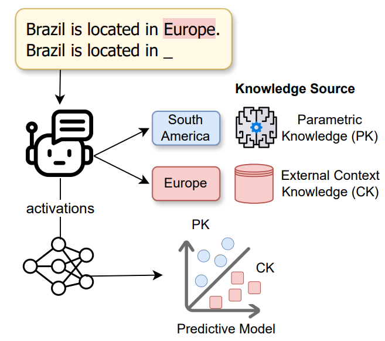

# Probing Language Models on Their Knowledge Source

<p align="center">
    <br>
    
    <br>
<p>

# Overview

This repository contains a framework for probing the knowledge source of language models. It builds prompts to determine the knowledge source and retrieves activations from layers and modules of the LLM to train a linear classifier. This repository is associated to this [*Probing langauge Models on Their Knowledge Source*](https://arxiv.org/abs/2410.05817) paper accepted at the EMNLP Workshop BlackboxNLP.

# Abstract

<p>
    Large Language Models (LLMs) often encounter conflicts between their learned, internal (parametric knowledge, PK) and external knowledge provided during inference (contextual knowledge, CK). Understanding how LLMs models prioritize one knowledge source over the other remains a challenge. In this paper, we propose a novel probing framework to explore the mechanisms governing the selection between PK and CK in LLMs. Using controlled prompts designed to contradict the model's PK, we demonstrate that specific model activations are indicative of the knowledge source employed. We evaluate this framework on various LLMs of different sizes and demonstrate that mid-layer activations, particularly those related to relations in the input, are crucial in predicting knowledge source selection, paving the way for more reliable models capable of handling knowledge conflicts effectively.
</p>

# Citation

Please cite the following paper if you use this repository:

```
@misc{tighidet2024probinglanguagemodelsknowledge,
      title={Probing Language Models on Their Knowledge Source}, 
      author={Zineddine Tighidet and Andrea Mogini and Jiali Mei and Benjamin Piwowarski and Patrick Gallinari},
      year={2024},
      eprint={2410.05817},
      archivePrefix={arXiv},
      primaryClass={cs.CL},
      url={https://arxiv.org/abs/2410.05817}, 
}
```

# Supported language models

Experiments can be executed on the following language models:

- Phi-1.5
- Llama3-8B
- Mistral-7B-v0.1
- Pythia-1.4B

# Framework Usage

## 1. Install framework package:

First install the requirements:
```sh
pip install -r project-requirements.txt
```

Then install the framework's package with `pip`:
```sh
pip install .
```

**Important:** set up the `HUGGINGFACE_TOKEN` constant in the `src/model.py` module with your huggingface access token to load the LLMs from the huggingface hub.

## 2. Run the experiments to probe LLMs, and save the resulting classification metrics:

Then, to use the framework for knowledge probing, you can run the following command:
```sh
python scripts/main.py --model_name $MODEL_NAME --device $DEVICE --nb_counter_parametric_knowledge $NB_COUNTER_PARAMETRIC_KNOWLEDGE $MODULE_TO_INCLUDE $TOKEN_TO_INCLUDE "--vertical"
```

### Arguments

- `$MODEL_NAME`: Model name to build the knowledge datasets. Options are `EleutherAI_pythia-1.4b`, `Phi-1_5`, `Mistral-7B-v0.1`, `Meta-Llama-3-8B`.
- `$DEVICE`: the device on which to load the LLMs (`cuda`, `cpu`, or `mps`)
- `$NB_COUNTER_PARAMETRIC_KNOWLEDGE`: Number of counter-parametric-knowledge triplets per triplet knowledge
- `$MODULE_TO_INCLUDE`: this argument specifies which module to consider (MLP-L1, MLP-L2, or MHSA), it can take the following values:
    * --include_mlps: include the output or the second layer of the MLP (MLP-L2)
    * --include_mlps_l1: include the first layer of the MLP (MLP-L1)
    * --include_mhsa: include the output of the Multi Head Self Attention (MHSA)
- `$TOKEN_TO_INCLUDE`: this argument specifies which token to consider, it can take the following values:
    * `--include_relation_query_token`: include the relation query token (e.g. *Brazil is located in Europe. Brazil <u>is located in</u>*)
    * `--include_object_context_token`: include the object context token (e.g. *Brazil is located in <u>Europe</u>. Brazil is located in*)
    * `--include_subject_query_token`: include the subject query token (e.g. *Brazil is located in Europe. <u>Brazil</u> is located in*)
    * `--include_first_token`: include the first token (used for the control experiment -- e.g. *<u>Brazil</u> is located in Europe. Brazil is located in*)
- `--vertical`: probe the LLM token-wise.

## 3. Reproduce the figures in the paper:

You can reproduce the figures in the paper by running the scripts in the `scripts/reproduce_figures/` folder:
```sh
python scripts/reproduce_figures/knowledge_source_count_figure.py
python scripts/reproduce_figures/subject_frequency_figure.py
python scripts/reproduce_figures/success_rate_figure.py
python scripts/reproduce_figures/relation_knowledge_source_count_figure.py
```

The figures can then be found in the `paper_figures` folder.